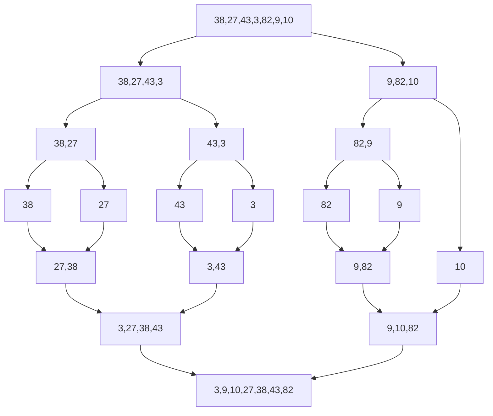

# push_swap

## Swap

<details>
  <summary>Detalle</summary>
	
<br><br/>
	
> **sa: swap a**

 Intercambia los dos primeros elementos encima del ```stack A```. No hace nada si hay uno o menos elementos.


<br><br/>

> **sb: swap b**

 Intercambia los dos primeros elementos encima del ```stack B```. No hace nada si hay uno o menos elementos.

 

<br><br/>

> **ss: swap sa y swap sb**

 Intercambia los dos primeros elementos encima del ```stack A``` e intercambia los dos primeros elementos encima del ```stack B```. No hace nada si hay uno o menos elementos.

 

<br><br/>

</details>

## Push

<details>
  <summary>Detalle</summary>

<br><br/>

> **pa: push a**

Toma el primer elemento del ```stack B``` y lo pone encima del ```stack A```. No hace nada si b está vacío.

 

<br><br/>

> **pb: push b**

Toma el primer elemento del ```stack A``` y lo pone encima del ```stack B```. No hace nada si b está vacío.

 

<br><br/>

</details>

## Rotate

<details>
  <summary>Detalle</summary>

<br><br/>

> **ra: rotate a**

Desplaza hacia arriba todos los elementos del ```stack A``` una posición, de forma que el primer elemento se convierte en el último.

 

<br><br/>

> **rb: rotate b**

Desplaza hacia arriba todos los elementos del ```stack B``` una posición, de forma que el primer elemento se convierte en el último.

 

<br><br/>

> **rr: rotate a y rotate b**

Desplaza al mismo tiempo todos los elementos del ```stack A``` y del ```stack B``` una posición hacia arriba, de forma que el primer elemento se convierte en el último.

 

<br><br/>

</details>

## Reverse

<details>
  <summary>Detalle</summary>

> **rra: reverse rotate a**

Desplaza hacia abajo todos los elementos del ```stack A``` una posición, de forma que el último elemento se convierte en el primero.

 
	
<br><br/>

> **rrb: reverse rotate b**

Desplaza hacia abajo todos los elementos del ```stack B```una posición, de forma que el último elemento se convierte en el primero.


   
	
<br><br/>

 > **rrr: reverse rotate a y reverse rotate b**  
	
Desplaza hacia abajo todos los elementos del ```stack A``` una posición y desplaza hacia abajo todos los elementos del ```stack B```una posición, de forma que el último elemento se convierte en el primero.

 

</details>

## Merge Sort (Ordenado por fusión)

Merge Sort es un algoritmo de divide y vencerás. Divide el stack de entrada de longitud n por la mitad sucesivamente hasta que haya n stack de tamaño 1. Luego, los pares de stack se fusionan con el primer elemento más pequeño entre el par de stack que se agregan en cada paso. A través de la fusión sucesiva y la comparación de los primeros elementos, se construye el stack ordenado.


**Complejidad del tiempo:**

$$T(n)       = 2T(n/2)       + Θ(n)$$

## Salida error

La salida de error estándar `(stderr)` normalmente se muestra en la consola junto con la salida estándar `(stdout)`, a menos que se redirija a otro lugar como un archivo o una tubería. Por lo tanto, si un programa escribe en stderr y se ejecuta desde la consola, la salida de error debería ser visible en la consola.

Para redirigir la salida de error a un archivo.

```c
./push_swap 42 84 2> error.txt
```


brew install coreutils
	export NUMEROS=$(jot -n 10 1 1000 | tr '\n' ' ')


	export NUMEROS=$(shuf -i 100-500 -n 10 | tr '\n' ' ')

